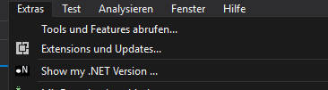
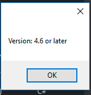

# FilePropeties

<!-- Replace this badge with your own-->

<!-- Update the VS Gallery link after you upload the VSIX-->
Download this extension from the [VS Gallery](https://visualstudiogallery.msdn.microsoft.com/[GuidFromGallery])
or get the [CI build](http://vsixgallery.com/extension/f6dfee9f-331a-4e3f-895d-914a1a42ec2f/).

---------------------------------------

This extension is only a first test of an intern. In the Menu you will get a Info about your current .NET Framework.

See the [change log](CHANGELOG.md) for changes and road map.

## Features

- Show me the installed -NET Version

## Contribute
Here are some scrrenshots

and then there is this popup

## License
[Apache 2.0](LICENSE)